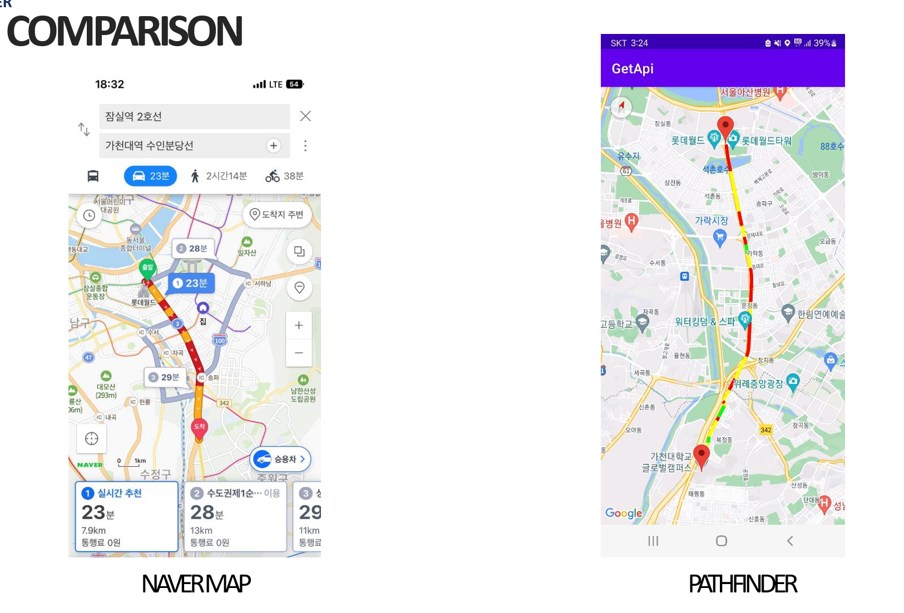

# PathFinder
### Using KOREA `GIS data` and Traffic information `API` to make personalized optimal `Directions APP`

## Steps
```bash
1. Enter the place of departure and destination

2. PathFinder explore road informations between departure and destination

3. Use GIS Data and Traffic API to find the optimal path
                  (Optimal : Distance-based / Time-based)
```

## Characteristics
* Can select optimal method
* Color the roads with the degree of road congestion
    * (Red / Yellow / Green)

## Compare Naver Map Vs. PathFinder


## Skill
* Java
* QGIS
* Google Maps
* 국가교통정보센터 API & GIS 데이터